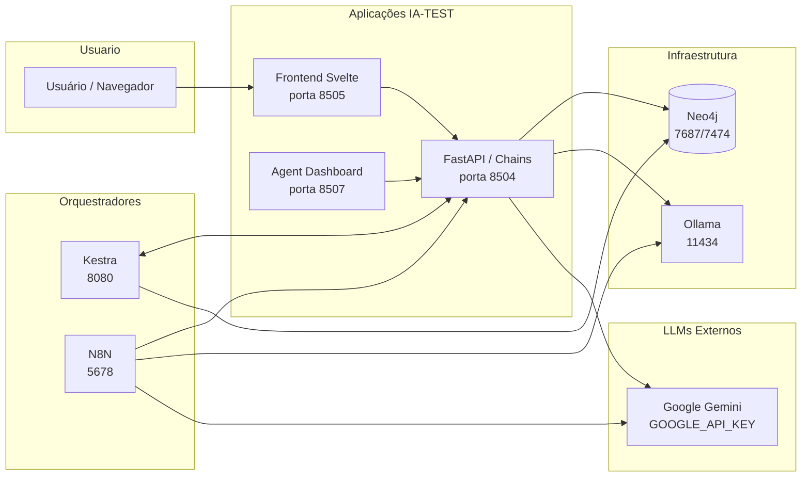
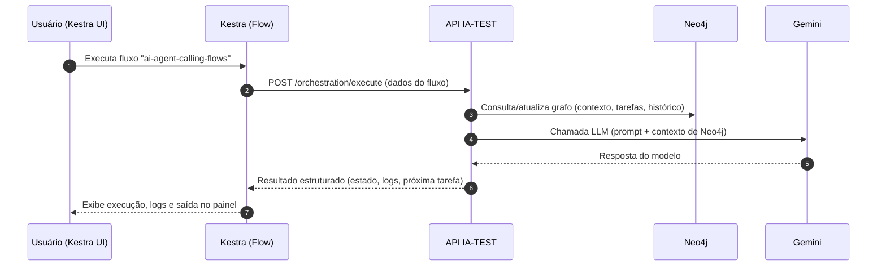
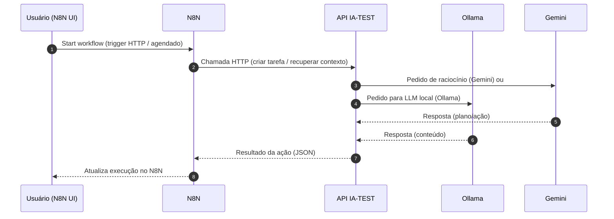

---
tags:
  - projeto
  - arquitetura
  - mermaid
---

# Arquitetura Geral – IA-TEST

Esta nota resume, em diagramas, como o seu sistema está montado hoje: aplicações, agentes, Kestra, N8N, bancos e LLMs.

Ligado a:
- Índice do projeto: [[INDEX-PROJETO-IA-TEST]]
- Serviços e portas: [[INFRA-SERVICOS-PORTAS]]
- Agentes e LLMs: [[AGENTES-E-LLMS]]

---

## 1. Visão macro do sistema



**Como ler:**
- O usuário acessa o **Frontend** e o **Agent Dashboard**, que conversam com a API.
- A API centraliza acesso a **Neo4j**, LLMs (Gemini/Ollama) e lógica dos agentes.
- **Kestra** e **N8N** atuam como orquestradores de workflows, chamando a API e outros serviços.

---

## 2. Stacks Docker principais

```mermaid
flowchart TB
    subgraph StackCore["Stack core (perfil: core)"]
      DBNEO[database (Neo4j)]
      API[api]
      FE[front-end]
      DASH[agent-dashboard]
    end

    subgraph StackStreamlit["Stack streamlit (perfil: streamlit)"]
      BOT[bot]
      LOADER[loader]
      PDFBOT[pdf_bot]
    end

    subgraph StackTools["Stack tools (perfil: tools)"]
      MCP[mcp-manager]
      KESTRA[kestra<br/>ia-test-kestra]
    end

    subgraph StackN8N["Stack N8N runner (externo)"]
      N8NAPP[n8n-acessivel]
      N8NPG[(Postgres N8N)]
      N8NREDIS[(Redis N8N)]
    end

    DBNEO <--> API
    API <--> FE
    API <--> DASH

    BOT --> API
    LOADER --> API
    PDFBOT --> API

    MCP --> API
    KESTRA --> API

    N8NAPP --> API
    N8NAPP --> N8NPG
    N8NAPP --> N8NREDIS
```

**Ideia:** cada “Stack” corresponde a grupos de serviços que você sobe com perfis do `docker-compose.yml` ou com composes separados (no caso do N8N runner).

---

## 3. Fluxo de um job via Kestra (exemplo)



---

## 4. Fluxo de automação via N8N + agentes



---

## 5. Próximos passos sugeridos para documentar

- Criar fluxos específicos por caso de uso:
  - `FLUXO-INGESTAO-DADOS.md` – como os dados entram no Neo4j e são disponibilizados.
  - `FLUXO-AGENTES-LLM.md` – detalhar como cada agente usa Gemini / Ollama.
- Para cada workflow importante no Kestra ou N8N, criar uma nota:
  - `KESRA-FLOW-<nome>.md` com:
    - link para o flow
    - print/resumo
    - um diagrama Mermaid simples com o passo a passo.


